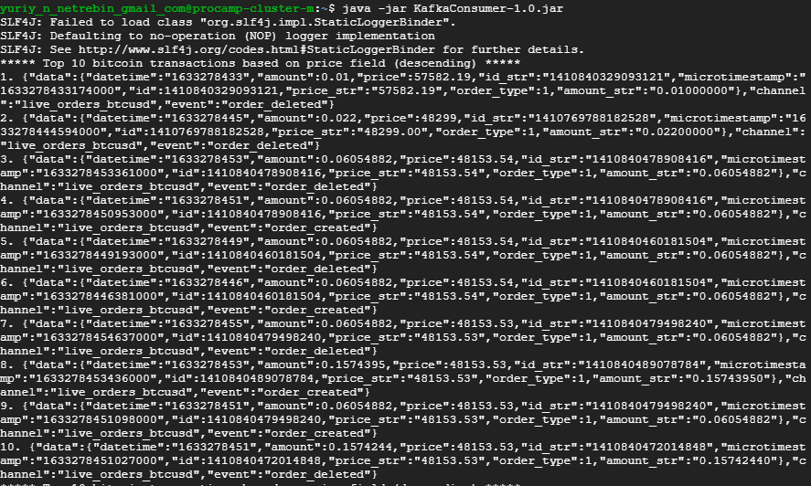

# HW3

Apache Kafka Lab 1

1. Import "Apache_Kafka_lab_1.xml" template to NiFi.
2. Upload template and run processors.
   
3. Connect to SSG server.
   
4. Upload "create-topic.sh" script in dataproc and run it.

```bash
sh create-topic.sh
```

4. Upload "build/libs/KafkaConsumer-1.0.jar" file and run it.

```bash
java -jar KafkaConsumer-1.0.jar 
```

